# Section 3.5 – Web Browser Platform Testing

This section records browser platform testing for Moonlight Warehouse Management System (Moonlight WMS). The purpose of browser testing is to confirm that the application remains functional across major browsers and that core user interactions behave consistently.

Testing focused on login, navigation between major pages, basic form interaction, and overall interface responsiveness. Where relevant, observations about browser-specific differences are noted in the result field.

| Tester | Browser & Version | Test Objective | Steps Taken | Result | Pass / Fail | Evidence |
|--------|-------------------|----------------|-------------|--------|-------------|----------|
| Marc Martin | Google Chrome (Windows 11) | Verify that Moonlight WMS operates correctly in Google Chrome on Windows 11. | Open Chrome → access Moonlight WMS → log in → navigate through Dashboard, Products, Inventory, and Audit Log → check form interaction and general responsiveness. | Application functioned correctly in Chrome. Login, navigation, and core page rendering behaved as expected with no blocking issues observed. | Pass ✅| Fig 3.5.1 – Chrome on Windows 11 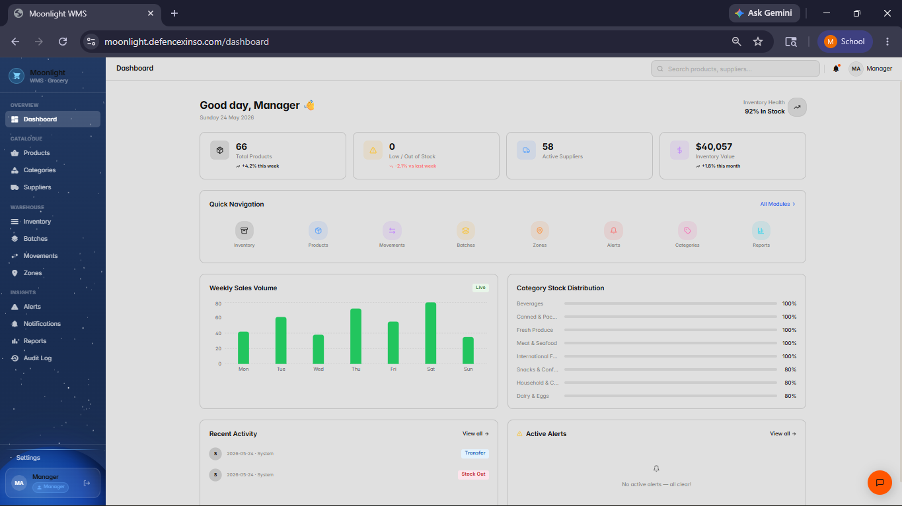 |
| Marc Martin | Mozilla Firefox (Windows 11) | Verify that Moonlight WMS operates correctly in Mozilla Firefox on Windows 11. | Open Firefox → access Moonlight WMS → log in → navigate through Dashboard, Products, Inventory, and Audit Log → check form interaction and general responsiveness. | Application remained usable in Firefox. Core pages loaded correctly and navigation worked, with only minor visual differences not affecting functionality. | Pass ✅ | Fig 3.5.2 – Firefox on Windows 11 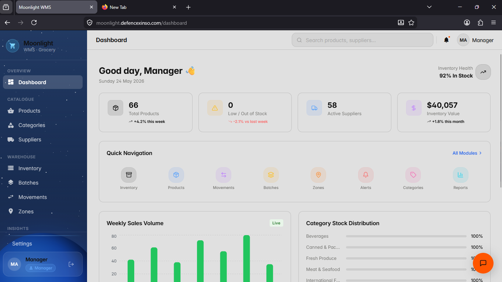 |
| Marc Martin | Microsoft Edge (Windows 11) | Verify that Moonlight WMS operates correctly in Microsoft Edge on Windows 11. | Open Edge → access Moonlight WMS → log in → navigate through Dashboard, Products, Inventory, and Audit Log → check form interaction and general responsiveness. | Application functioned correctly in Edge. No major layout, navigation, or usability issues were observed during testing. | Pass ✅ | Fig 3.5.3 – Edge on Windows 11 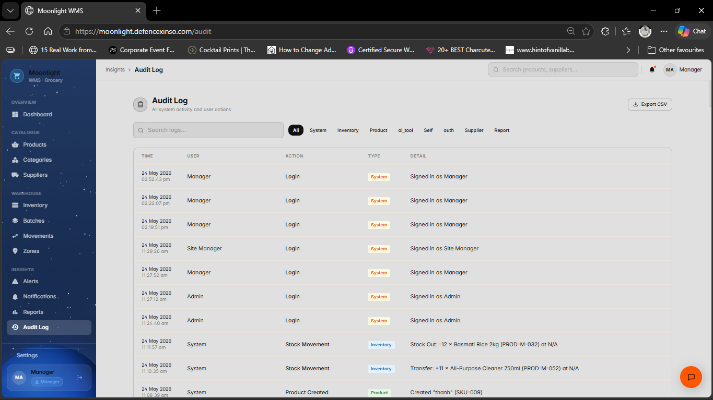 |
| [Friend’s name] | Safari (macOS) | Verify that Moonlight WMS operates correctly in Safari on macOS. | On macOS → open Safari → access Moonlight WMS → log in → navigate through Dashboard, Products, Inventory, and Audit Log → check form interaction and general responsiveness. | Application functioned correctly in Safari on macOS. Login, navigation, and page rendering behaved as expected, and no blocking issues were reported by the tester. | Pass ✅ | Fig 3.5.4 – Safari on macOS 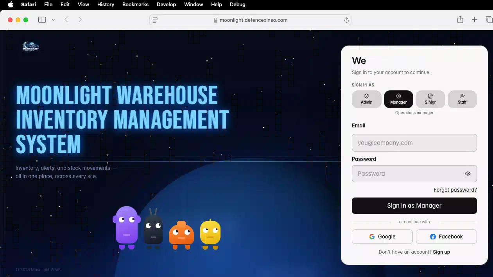 |

### 3.5.1 – Google Chrome on Windows 11

This table records detailed browser testing of Moonlight Warehouse Management System (Moonlight WMS) in Google Chrome on Windows 11 by Marc Martin.

| Test ID | Tester | Page / Area | Test Objective | Steps | Result | Pass / Fail | Evidence |
|--------|--------|------------|----------------|-------|--------|-------------|----------|
| CHR-01 | Marc Martin | Login page | Verify that the login page loads and accepts valid credentials in Chrome. | Open Chrome → navigate to Moonlight WMS URL → check that the login page loads → enter valid credentials → click Login. | Login page loaded correctly and a valid user could sign in without visible errors. | Pass | 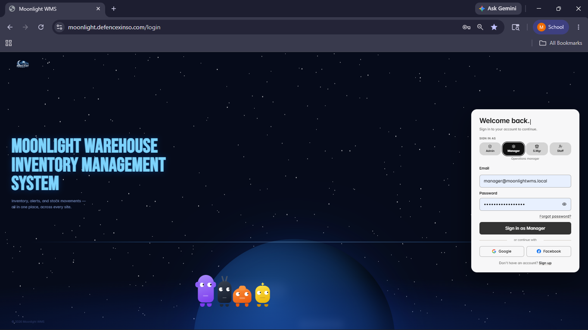|
| CHR-02 | Marc Martin | Dashboard – quick navigation | Verify that key dashboard widgets and quick navigation tiles load and respond. | After login → open Dashboard → review KPI charts and tiles → click several quick‑navigation tiles to open target modules. | Dashboard loaded with charts and tiles; quick‑navigation links opened their target pages successfully. | Pass | 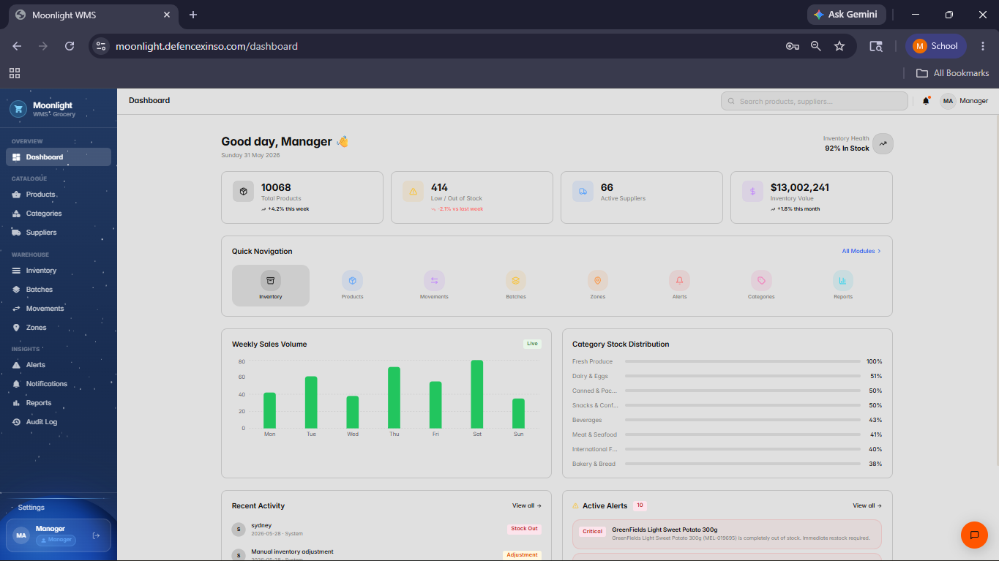|
| CHR-03 | Marc Martin | Sidebar navigation | Verify that the left sidebar menu expands, collapses, and navigates between modules. | From any authenticated page → expand/collapse sidebar sections → click multiple menu items (e.g. Dashboard, Products, Inventory, Reports). | Sidebar expanded and collapsed correctly; each menu item opened the expected module with no navigation issues. | Pass |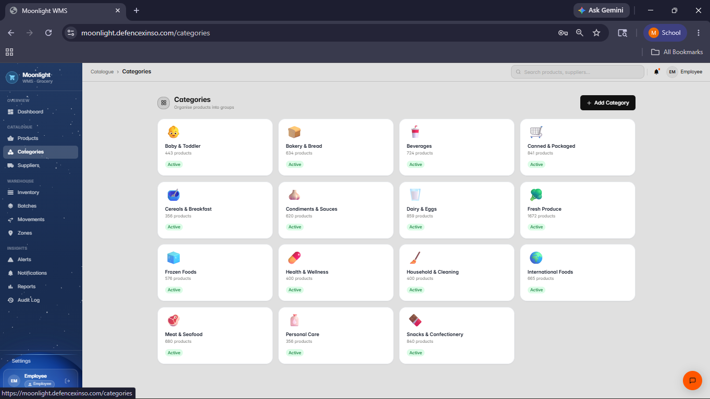|
| CHR-04 | Marc Martin | Reports – browsing | Verify that the Reports page loads and allows browsing of available reports. | Open Reports from sidebar or dashboard tile → wait for list of reports → scroll through the list and select a report. | Reports page loaded, list of reports was visible, and an individual report could be selected for viewing. | Pass | 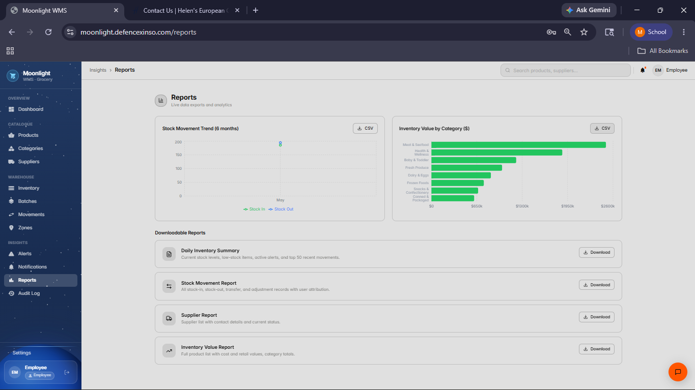|
| CHR-05 | Marc Martin | Reports – downloading | Verify that a report can be generated and downloaded in Chrome. | On Reports page → select a report → trigger export/download (e.g. Download or Export button) → confirm download starts. | Report export completed and a file was downloaded by the browser without error prompts. | Pass |  |
| CHR-06 | Marc Martin | Reports – opening downloaded file | Verify that the downloaded report file can be opened from Chrome’s downloads. | After download completes → open the downloaded file from Chrome’s download bar or file explorer → confirm contents are readable. | Downloaded report opened successfully and data inside the file matched the expected report content. | Pass | 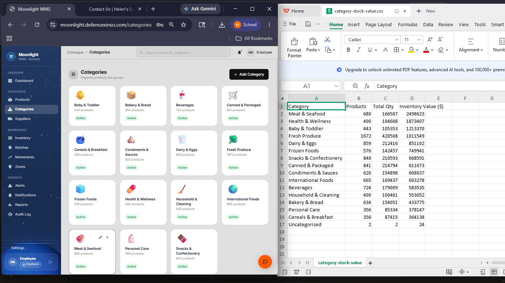 |
| CHR-07 | Marc Martin | Suppliers – add supplier (form open) | Verify that the “Add Supplier” form opens correctly in Chrome. | Navigate to Suppliers module → click “Add Supplier” or equivalent action → observe the add‑supplier form. | Add Supplier form opened correctly with all expected fields visible and ready for input. | Pass | 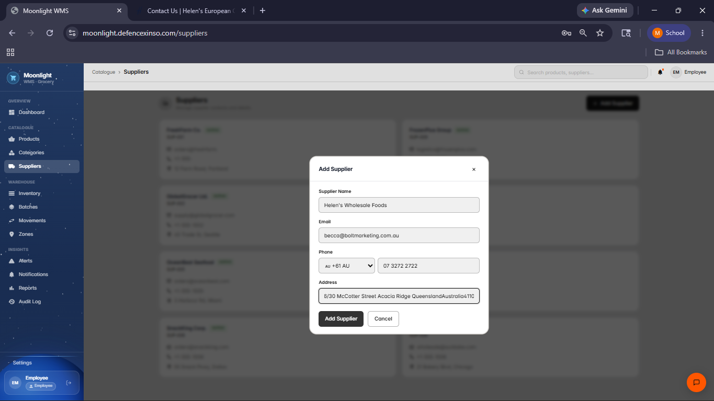 |
| CHR-08 | Marc Martin | Suppliers – add supplier (submit) | Verify that a new supplier can be created using the add‑supplier form. | With Add Supplier form open → fill in mandatory fields (e.g. name, contact, address) → submit the form → check updated supplier list. | Form submitted successfully and the new supplier appeared in the supplier list without error messages. | Pass | 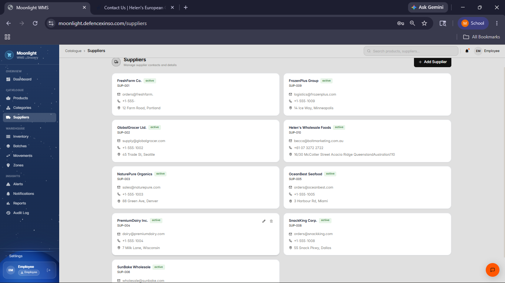 |

### 3.5.2 – Microsoft Edge on Windows 11

This table records detailed browser testing of Moonlight Warehouse Management System (Moonlight WMS) in Microsoft Edge on Windows 11 by Marc Martin.

| Test ID | Tester | Page / Area | Test Objective | Steps | Result | Pass / Fail | Evidence |
|--------|--------|------------|----------------|-------|--------|-------------|----------|
| EDG-01 | Marc Martin | Login page | Verify that the login page loads and accepts valid credentials in Edge. | Open Microsoft Edge → navigate to the Moonlight WMS URL → confirm that the login page loads → enter valid credentials → click Login. | Login page loaded correctly and a valid user could sign in without visible errors. | Pass | Edge‑MWMS‑LoginTest.png |
| EDG-02 | Marc Martin | Dashboard – quick navigation | Verify that the main dashboard loads correctly and supports quick navigation to other modules in Edge. | After login → open Dashboard → review KPI charts and tiles → click several quick‑navigation tiles to open target modules (e.g. Users, Activity Logs). | Dashboard loaded with charts and tiles; quick‑navigation links opened their target pages successfully in Edge. | Pass | Edge‑MWMS‑Dashboard‑Quick‑Navigation‑Test.png |
| EDG-03 | Marc Martin | Sidebar navigation | Verify that the left sidebar menu expands, collapses, and navigates between modules in Edge. | From any authenticated page → expand/collapse sidebar sections → click multiple menu items (Dashboard, Users, Activity Logs, Reports). | Sidebar expanded and collapsed correctly; each menu item opened the expected module with no navigation issues in Edge. | Pass | Edge‑MWMS‑SidebarTest.png |
| EDG-04 | Marc Martin | Users – open add‑user form | Verify that the “Add User” form opens correctly in Edge. | Navigate to Users module → click “Add User” → observe that the add‑user form appears. | Add User form opened correctly with all expected fields visible and ready for input. | Pass | Edge‑adding‑user‑test‑01.png |
| EDG-05 | Marc Martin | Users – create new user | Verify that a new user can be created and saved in Edge. | With Add User form open → fill in mandatory fields (name, email, role, site) → submit the form → check that the new user appears in the Users list. | Form submitted successfully and the new user appeared in the user list with correct details and no error messages. | Pass | Edge‑adding‑user‑test‑02.png |
| EDG-06 | Marc Martin | Activity Logs – browsing & filtering | Verify that Activity Logs page loads and supports filtering of activity entries in Edge. | Navigate to Activity Logs → wait for entries to load → apply one or more filters (e.g. date range, user, action) → observe filtered results. | Activity Logs page loaded with data; filters updated the list as expected and no errors were observed. | Pass |  |
| EDG-07 | Marc Martin | Activity Logs – record inspection | Verify that individual activity entries can be opened or inspected for details. | On Activity Logs page → select one or more entries → open or expand details (if available) to review fields such as user, action, time. | Selected activity entries displayed full details, confirming that log information is accessible and readable. | Pass | Edge‑MWMS‑Viewing‑Activity‑Logs.png |
| EDG-08 | Marc Martin | Activity Logs – export, download and verify | Verify that Activity Logs can be exported from Edge and that the downloaded file matches on‑screen data. | On Activity Logs page → use export/download function → confirm file download in Edge → open the downloaded file → compare a sample of records with the on‑screen Activity Logs. | Export completed successfully; the downloaded file opened correctly and sampled records matched the Activity Logs shown in the application. No discrepancies were found. | Pass | Edge‑MWMS‑Opening‑downloaded‑ActivityLogs.png |
